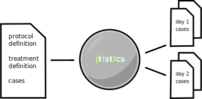
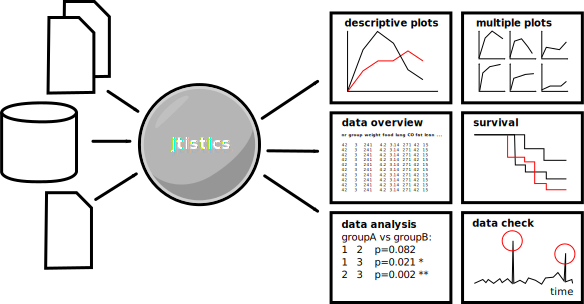

jtistics
========

*plan, supervise, and analyse*

*clinical trials and experimental protocols*

sandra.palnullus@chnoenadaarite.de | arne.hnoilmann@tney-online.de

Expertise
=========

-   5000+ cases

-   7 protocols

-   4 models: cancer cachexia, heart insufficiency, amyotrophic lateral
    sclerosis, stroke

-   200+ treatment groups

-   8+ years in-field expertise

Key Features
============

-   handles a broad range of clinical analyses

-   enables you to define protocols and cases clearly

-   keeps track of treatment groups, assists with randomization

-   generates task plans for every day and analysis

-   allows early consistency check of gathered data

-   performs fast statistical analyses, allowing early intervention

Additional Features
===================

-   uses simple spradsheets as user frontend

-   data and executables fit on normal usb drive

-   task plans are meant to be taken to the animal facility

-   modular architecture allows integration of new data sources

-   has a 1-click-interface

Phase 1: Planing
================

Supported Clinical Analyses
===========================

-   locomotor activity

-   echocardiography

-   body weight

-   food intake

-   histology

-   nmr

Technical Details
=================

supports a variety of platforms (Windows, Linux, MacOS)

data integrity ensured by database schema

underlying sql database allows easy data access for other tools

Phase 2: Data Integration/Analysis
==================================

Statistical Analyses
====================

-   significance tests

-   regression tests

-   multipanel plots

-   linear models

-   correlations

-   survival

Software Details
================

LibreOffice (frontend interface)

Java, Python (data im-/export)

ant (flow control)

R (statistical analyses)
